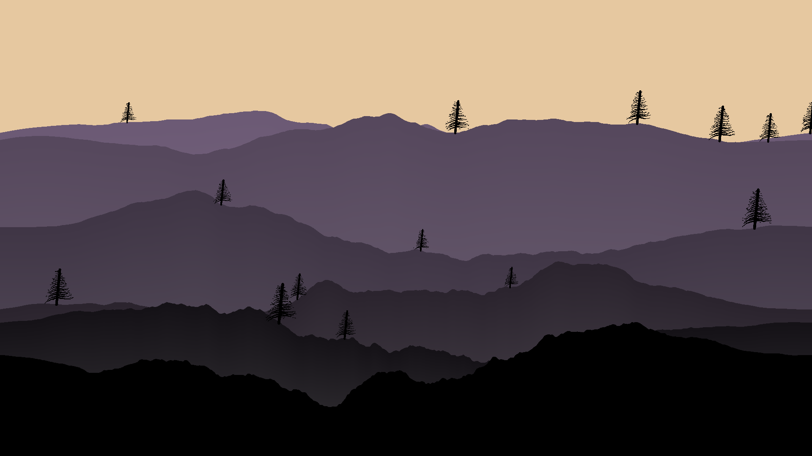

# mtns

A small Go script that procedurally generates random, stylized mountain landscapes.

It creates minimalistic scenes using randomly generated mountain ranges, trees, cabins, and other simple elements. Each run can produce a different landscape.

### Example



### Run

```bash
go run .
```

Use the `--help` flag to see all available variables and options.
